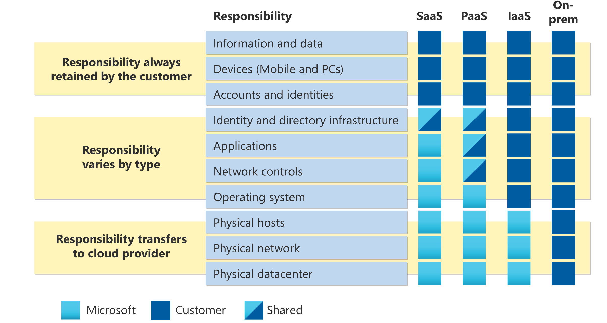

# Describe the shared responsibility model

共有責任モデルを聞いたことがあるかもしれませんが、その意味やクラウドコンピューティングに与える影響について理解していないかもしれません。

### 従来的な企業型データセンター
物理スペースのメンテナンス、セキュリティの確保、万が一の場合のサーバーの保守・交換などの責任があります。IT部門はデータセンターを稼働させるために必要な全てのインフラとソフトウェアの保守を担当します。さらに、全てのシステムにパッチを適用し、正しいバージョンに保つ責任も負っているようです。

### 共有責任モデル
全ての責任はクラウドプロバイダーと利用者間で共有されています。物理セキュリティ、電力、冷却、ネットワーク接続はクラウドプロバイダーが責任を持ちます。利用者はデータセンターと同じ場所にいることがないため、そのような責任を負う意味がないのでしょう。

同時に利用者はクラウドに保存しているデータと情報に責任を負う必要があります。(クラウドプロバイダーに情報を読み取られたくないだろうから。)利用者は必要な人にのみアクセスを許可する、アクセスセキュリティの責任も負っています。

それから、ものによっては、状況により責任の所在が変わってきます。SQLデータベースを使用するなら、実際のデータベースをメンテナンスする責任はクラウドプロバイダーが負うでしょう。しかし、データベースに格納されるデータに関しての責任は依然として利用者にあります。仮に、仮想マシンをデプロイしSQLデータベースをインストールした場合、データベースに格納したデータと情報のメンテナンスだけでなく、データベースへのパッチの適用、アップデートは利用者の責任となります。

オンプレのデータセンターでは全ての責任を利用者が負います。クラウドコンピューティングでは、それらの責任が変化します。共有責任モデルでは、クラウドサービスの種類と大きく結びつきます(このラーニングパスで学べる)。
種類
1. IaaS
2. PaaS
3. SaaS
- IaaS
利用者に最も責任があり、クラウドプロバイダーは物理的なセキュリティ、電力、接続性などの基本的な責任を負います。
- SaaS
クラウドプロバイダーがほとんどの責任を負います。
- PaaS
IaaSとSaaSの中間的な存在で、クラウドプロバイダーと利用者の間で均等に責任を分散できます。

次の図は、クラウドサービスの種類に応じて、誰が何に責任を負うのかを示す共有責任モデルの概要を示しています。
  

- 利用者側の責任
クラウドに格納する情報とデータ
クラウド環境に接続を許可するデバイス
組織内の人間、サービス、デバイスのアカウントとアイデンティティ

- クラウドプロバイダー側の責任
物理データセンター
物理ネットワーク
物理ホスト

- サービスモデルによって決まる責任
OS
ネットワーク制御
アプリケーション
アイデンティティとインフラ

### 英語
impacts : 影響
ensure : 確保
replacing : 代わりに 替わりに 保守・交換[^1]
department : 部門 **これは単語帳にあった！！！**
likely : ~のよう
depend : 依存 頼る **単語帳でやったはず！！！**
tie : 結びつく
rest : 位置する 静止する
distribute : 配る 割り当てる
determine : 決める
## 例文
if anything happens : あわよくば 万が一[^1]
is responsible : が担当
keep ~ up and running : を稼働させ続ける
so it wouldn’t make sense : ~だから意味がない
make sense : 意味をなす 分かる
At the same time : 同時に
wouldn’t want : まいった 困る ~ないだろう
Then, for some things : それから、あるものに対して
as well as : のみならず
On the other end of the spectrum : 一方で
rests somewhere in : ~に位置する
[^1]:原文上での意味